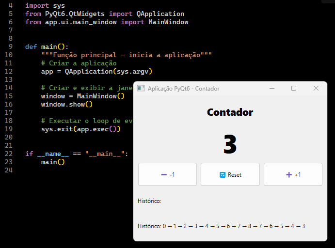

# PyQt6 Project - Simple Counter

A simple educational PyQt6 application demonstrating the proper structure of a graphical application project.




## Project Structure

```text
pyqt6_app/
├── main.py                 # Application entry point
├── requirements.txt        # Project dependencies
├── README.md               # This file
└── app/                    # Main package
    ├── __init__.py
    ├── ui/                 # Graphical User Interface (View)
    │   ├── __init__.py
    │   └── main_window.py  # Main window
    ├── logic/              # Application Logic (Model)
    │   ├── __init__.py
    │   └── counter.py      # Counter class
    └── resources/          # Resources (icons, images, etc.)
```

## Concepts Implemented

### 1. **MVC Architecture** (Model-View-Controller)

* **Model** (`app/logic/counter.py`): Business logic
* **View** (`app/ui/main_window.py`): Graphical interface
* **Controller**: Connections between signals and slots

### 2. **Separation of Responsibilities**

* Logic separated from the user interface
* Easy to test and maintain
* Reusable across different UIs

### 3. **PyQt6 Patterns**

* Signals and Slots (event connections)
* Layouts for responsive positioning
* `QFont` for typography and styling
* Separation into modules

## How to Run

### 1. Create a virtual environment (optional but recommended)

```bash
cd pyqt6_app
python -m venv venv
```

Linux/macOS:

```bash
source venv/bin/activate
```

Windows:

```bash
venv\Scripts\activate
```

On Windows, prefer a native Windows Python interpreter for this project. Avoid running it with Git Bash's `/usr/bin/python3` (MSYS Python), because PyQt6 wheels are built for standard Windows Python and may fail to import Qt DLLs there.

### 2. Install dependencies

```bash
pip install -r requirements.txt
```

### 3. Run the application

```bash
python main.py
``` 
 
